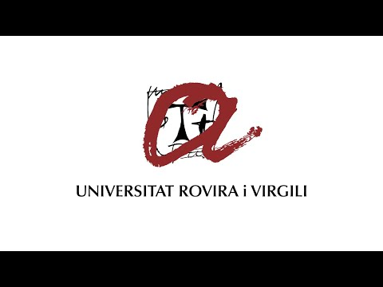
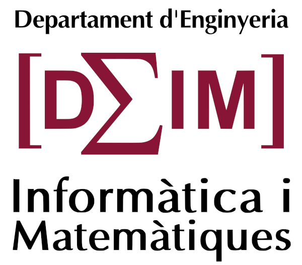

<a name="readme-top"></a>

<!-- PROJECT SHIELDS -->
[![Top language][language-shield]][language-url]
[![Language count][language-count-shield]][language-count-url]
[![GNU GPL v3 License][license-shield]][license-url]
[![Lines of code][loc-shield]][loc-url]
[![Number of commits since v0.1][commit-shield]][commit-url]
[![Commit activity][activity-shield]][activity-url]
[![Repository size][repo-size-shield]][repo-size-url]
[![CD pipeline][CD-pipeline-shield]][CD-pipeline-url]

<!-- PROJECT LOGO -->
<br />
<div align="center">
  <a href="https://urv.cat">
    
  </a>

<h6 align="center">presents</h3>


<h3 align="center">hello-world-nds</h3> 

  <p align="center">
    Hello world project for NDS, using devKitPro based on devkitPro Updater 1.6.0 (ARM v5)
    <br />
    <a href="#usage"><strong>Explore the docs »</strong></a>
    <br />
    <br />
    ·
    <a href="https://github.com/URV-teacher/hello-world-nds/issues/new">Report Bug</a>
    ·
    <a href="https://github.com/URV-teacher/hello-world-nds/issues/new">Request Feature</a>
  </p>
</div>


<!-- TABLE OF CONTENTS -->
<details>
  <summary>Table of Contents</summary>
  <ol>
    <li>
      <a href="#about-the-project">About The Project</a>
      <ul>
        <li><a href="#built-with">Built With</a></li>
      </ul>
    </li>
    <li><a href="#getting-started">Getting Started</a></li>
    <li><a href="#usage">Usage</a></li>
      <ul>
        <li><a href="#How-to-add-a-new-signature">How to add a new signature</a></li>
        <li><a href="#How-to-update-a-signature">How to update a signature</a></li>
        <li><a href="#How-to-update-all-signatures">How to update all signatures</a></li>
      </ul>
    <li><a href="#Components">Components</a></li>
      <ul>
        <li><a href="#Bulk-update-of-secrets">Bulk update of secrets</a></li>
        <li><a href="#Secrets">Secrets</a></li>
        <li><a href="#How-to-update-all-signatures">How to update all signatures</a></li>
        <li><a href="#Data-files">Data files</a></li>
        <li><a href="#Template">Template</a></li>
        <li><a href="#Template-render">Template render</a></li>
        <li><a href="#Template-output">Template output</a></li>
        <li><a href="#Email-sending">Email sending</a></li>
        <li><a href="#Workflow">Workflow</a></li>
      </ul>
    <li><a href="#Roadmap">Roadmap</a></li>
    <li><a href="#contributing">Contributing</a></li>
    <li><a href="#license">License</a></li>
    <li><a href="#contact">Contact</a></li>
    <li><a href="#acknowledgments">Acknowledgments</a></li>
    <li><a href="#Credits">Credits</a></li>
      <ul>
        <li><a href="#Institutions-involved-in-the-hello-world-nds-project">Institutions involved in the hello-world-nds project</a></li>
        <li><a href="#People-involved-in-the-hello-world-nds-development">People involved in the hello-world-nds development</a></li>
      </ul>
  </ol>
</details>


<!-- ABOUT THE PROJECT -->
## About The Project

[![Product Name Screen Shot][product-screenshot]](https://github.com/URV-teacher/hello-world-nds/.github/images/product-screenshot.png)

This repository contains the source code for creating a `.nds` executable that you can run in real or emulated hardware
of the Nintendo DS. 

This project has been created as a way to test compilation environments.

It also features a workflow that builds and releases the binary on every commit.

To know more about my projects as a teacher for University Rovira i Virgili, you can check the
[GitHub page](https://github.com/URV-teacher).

<p align="right">(<a href="#readme-top">back to top</a>)</p>


#### Built With

This section lists any major languages, frameworks and libraries used to bootstrap the hello-world-nds platform:

* [![C][c-shield]][c-url]
* [![Assembly][assembly-shield]][assembly-url]
* [![Makefile][makefile-shield]][makefile-url]
* [![GIT][git-shield]][git-url]
* [![Bash][bash-shield]][bash-url]
* [![devkitPro][devkitpro-shield]][devkitpro-url]  
* [![devkitARM][devkitarm-shield]][devkitarm-url]
* [![libnds][libnds-shield]][libnds-url]
* [![DeSmuME][desmume-shield]][desmume-url]
* [![Flatpak][flatpak-shield]][flatpak-url]
* [![Docker][docker-shield]][docker-url]

<p align="right">(<a href="#readme-top">back to top</a>)</p>


<!-- GETTING STARTED -->
## Getting Started
### Install development environment 
###### Windows
You can install it manually by moving the `bmde` folder (not included) into `C:\URV\` and creating the corresponding 
environment variables.

Afterward, you can do the following to clone, compile and run the code:
```shell
git clone https://github.com/URV-teacher/bmde-linux
cd bmde-linux
make clean
make
make run
```

###### Multi-platform (Docker)
1. Install Docker in your system.
2. Clone the `bmde` repository: `git clone https://github.com/URV-teacher/bmde-linux`
3. Enter inside the `input` folder: `cd bmde-linux/input` and clone this repo: `git clone https://github.com/URV-teacher/hello-world-nds`


### Compile software
###### Windows
1. Open a terminal in the root folder of the NDS project that you want to compile.
2. Execute `make`.
3. The `.nds` binary from the project should be in the root folder of the repository. 

###### Multi-platform (Docker)
1. Go back to the root folder of the repository `bmde`: `cd ..`
2. Run `docker compose up`
3. The `.nds` binary from the `hello-world-nds` project will be on the `output` folder.


### Run software
###### Windows
1. Download and install DeSmuME from [official page](https://desmume.org/download/). We target version `0.9.11-dev` that
   you can download from [here][desmume-download], but the binary also has been proved to work in later versions.
2. Run DeSmuME and open the `.nds` file.
3. You should see the "Hello world" message being displayed in the inferior screen of the NDS.

###### Multi-platform (Flatpak)
1. Download and install Flatpak `flatpak install flathub org.desmume.DeSmuME`
2. Run DeSmuMe Flatpak `flatpak run org.desmume.DeSmuME`
3. open the `.nds` file.
4. You should see the "Hello world" message being displayed in the inferior screen of the NDS.

<p align="right">(<a href="#readme-top">back to top</a>)</p>


<!-- USAGE EXAMPLES -->
<!-- Use this space to show useful examples of how a project can be used. Additional screenshots, code examples and demos 
work well in this space. You may also link to more resources. -->
## Usage
You can use this project as a basic compilation test tool for a NDS development environment. 

This project was used to test the
port of the `bmde` environment to Linux that is used in the subjects Computers, Computer Fundamentals and Operating 
System Structure
in the Universitat Rovira i Virgili.

###### Workflow
There is also a GitHub workflow that is triggered on every push to `master` branch to compile the project and release
it. You can download the `.nds` from [there](https://github.com/URV-teacher/hello-world-nds/releases/tag/v1.0) to try it
directly without compilation.

<p align="right">(<a href="#readme-top">back to top</a>)</p>


<!-- ROADMAP -->
## Roadmap
This project is completely functional! But there is space for improvements...
- Refine Docker for usage with the port of the `bmde` environment to Linux.

See the [open issues](https://github.com/URV-teacher/hello-world-nds/issues) for a full list of proposed features
(and known issues).

<p align="right">(<a href="#readme-top">back to top</a>)</p>


<!-- CONTRIBUTING -->
## Contributing
This is an open-source project, so any contributions are **greatly appreciated** ❤.

If you have an issue or suggestion that would make hello-world-nds better, please
[open a new issue](https://github.com/URV-teacher/hello-world-nds/issues/new) explaining your inquiry. We will try
to satisfy your
needs as soon as possible.

If you want to make a contribution to hello-world-nds by yourself, please
[open a new issue](https://github.com/URV-teacher/hello-world-nds/issues/new), so we can discuss the reach of your
contribution.
After that, [fork the repo](https://github.com/URV-teacher/hello-world-nds/fork), implement your change and create a
[pull request](https://github.com/URV-teacher/hello-world-nds/compare) from your fork to the `master` branch. We will merge
your changes as soon as possible, so they are available in the next releases of hello-world-nds-asban.

So, for each change that you want to do to hello-world-nds-asban by yourself, you will need to:
1. [Fork the repo](https://github.com/URV-teacher/hello-world-nds/fork).
2. Create your Feature Branch (`git checkout -b feature/AmazingFeature`).
3. Add and commit your Changes (`git add src; git commit -am 'Add some AmazingFeature'`).
4. Push to the Branch (`git push origin feature/AmazingFeature`).
5. Repeat steps 3 and 4 as many times as you need.
6. [Open a pull request from your fork to the develop branch](https://github.com/URV-teacher/hello-world-nds/compare).
7. Repeat steps 3 and 4 if further changes are required.

Do not forget to give the project a star ⭐ on GitHub!

<p align="right">(<a href="#readme-top">back to top</a>)</p>


<!-- LICENSE -->
## License


Distributed under the [GNU AFFERO GENERAL PUBLIC LICENSE, Version 3](https://www.gnu.org/licenses/agpl-3.0.en.html).
See [`LICENSE`](https://github.com/URV-teacher/hello-world-nds/blob/master/LICENSE) to obtain a copy of the therms
of this license.

This software was developed by [Aleix Mariné-Tena](https://github.com/AleixMT), substitute teacher at University
Rovira i Virgili of subjects Computers and Computer Fundamentals. 

**hello-world-nds ultimately belongs to [Aleix Mariné-Tena](https://github.com/AleixMT) and has the control over
the licensing and distribution therms.**

>Copyright 2025 - Present [Aleix Mariné-Tena](https://github.com/AleixMT)

>This program is free software: you can redistribute it and/or modify it under the terms of the GNU Affero General Public
License as published by the Free Software Foundation, either version 3 of the License, or (at your option) any later
version.
>
>This program is distributed in the hope that it will be useful, but WITHOUT ANY WARRANTY; without even the implied warranty of
MERCHANTABILITY or FITNESS FOR A PARTICULAR PURPOSE. See the GNU Affero General Public License for more details.

<p align="right">(<a href="#readme-top">back to top</a>)</p>


<!-- CONTACT -->
## Contact

>Aleix Mariné-Tena - [aleix.marine@urv.cat 📫](aleix.marine@urv.cat)

You can get more information of URV at https://urv.cat.

<p align="right">(<a href="#readme-top">back to top</a>)</p>


<!-- ACKNOWLEDGMENTS -->
## Acknowledgments
Shout out to [@WinterMute](https://github.com/WinterMute) and his team that created devkitPro.

<p align="right">(<a href="#readme-top">back to top</a>)</p>


## Credits
#### Institutions involved in the hello-world-nds project

[Universitat Rovira i Virgili (URV)](https://urv.cat/): URV, The Universitat Rovira i Virgili is the university that 
provides southern Catalonia with a knowledge structure of international renown. Through teaching, research, knowledge 
transfer and culture it helps society to be more just and free.


[Departament d'Enginyeria Informàtica i Matemàtiques (URV)](https://urv.cat/): The Department of Computer Engineering
and Mathematics (DEIM) is a department in the URV made up of professors and researchers specializing in different 
disciplines corresponding to 
areas of knowledge of Computer Science, Telematics and Mathematics.


#### People involved in the hello-world-nds development
* **Aleix Mariné-Tena (ASBTEC)**: Informatics responsible of ASBTEC. Main developer of *hello-world-nds*.


<!-- MARKDOWN LINKS & IMAGES -->
<!-- https://www.markdownguide.org/basic-syntax/#reference-style-links -->
[forks-shield]: https://img.shields.io/github/forks/URV-teacher/hello-world-nds.svg?style=for-the-badge&label=Fork&maxAge=2592000
[forks-url]: https://github.com/URV-teacher/hello-world-nds/network/members
[license-shield]: https://img.shields.io/github/license/URV-teacher/hello-world-nds?style=flat-square&color=darkgreen&logo=gnu
[license-url]: https://github.com/URV-teacher/hello-world-nds/blob/master/LICENSE
[product-screenshot]: .github/images/product-screenshot.png

[language-shield]: https://img.shields.io/github/languages/top/URV-teacher/hello-world-nds?style=flat-square&color=yellow&logo=gnubash
[language-url]: https://www.gnu.org/software/bash/
[loc-shield]: https://img.shields.io/endpoint?url=https://ghloc.vercel.app/api/URV-teacher/hello-world-nds/badge?filter=.html$,.sh$,.js$&style=flat&logoColor=white&label=Lines%20of%20Code
[loc-url]: https://github.com/URV-teacher/hello-world-nds
[commit-shield]: https://img.shields.io/github/last-commit/URV-teacher/hello-world-nds/master?style=flat-square&logo=github
[commit-url]: https://github.com/URV-teacher/hello-world-nds/issues
[activity-shield]: https://img.shields.io/github/commit-activity/y/URV-teacher/hello-world-nds?style=flat-square&color=purple&logo=github
[activity-url]: https://github.com/URV-teacher/hello-world-nds/graphs/commit-activity
[repo-size-shield]: https://img.shields.io/github/repo-size/URV-teacher/hello-world-nds?style=flat-square&logo=github
[repo-size-url]: https://github.com/URV-teacher/hello-world-nds
[language-count-shield]: https://img.shields.io/github/languages/count/URV-teacher/hello-world-nds?style=flat-square&color=red&logo=github
[language-count-url]: https://github.com/URV-teacher/hello-world-nds
[CD-pipeline-shield]: https://img.shields.io/github/actions/workflow/status/URV-teacher/hello-world-nds/buildAndSendSignatures.yml?style=flat-square&logo=githubactions&label=last%20workflow%20execution
[CD-pipeline-url]: https://github.com/URV-teacher/hello-world-nds/actions/workflows/buildAndSendSignatures.yml

[git-shield]: https://img.shields.io/badge/git-2.25.1-brown?style=for-the-badge&logo=git
[git-url]: https://git.com
[bash-shield]: https://img.shields.io/badge/bash-5.0.17-green?style=for-the-badge&logo=gnubash
[bash-url]: https://www.gnu.org/software/bash/
[c-shield]: https://img.shields.io/badge/c-99-black?style=for-the-badge&logo=c
[c-url]: https://www.programiz.com/c-programming
[assembly-shield]: https://img.shields.io/badge/assembly-v5-orange?style=for-the-badge&logo=asm
[assembly-url]: https://en.wikipedia.org/wiki/Assembly_language
[makefile-shield]: https://img.shields.io/badge/makefile-3.81-red?style=for-the-badge&logo=makefile
[makefile-url]: https://www.gnu.org/software/make/manual/make.html
[devkitpro-shield]: https://img.shields.io/badge/devkitPro-WinUpdater1.6.0-grey?style=for-the-badge&logo=devkitpro
[devkitpro-url]: https://devkitpro.org/wiki/Main_Page
[devkitarm-shield]: https://img.shields.io/badge/devkitARM-r46-grey?style=for-the-badge&logo=devkitpro
[devkitarm-url]: https://devkitpro.org/wiki/devkitARM
[libnds-shield]: https://img.shields.io/badge/libnds-0.5.0-blue?style=for-the-badge&logo=libnds
[libnds-url]: https://libnds.devkitpro.org/
[desmume-shield]: https://img.shields.io/badge/DeSmuME-0.9.11.dev-blue?style=for-the-badge&logo=DeSmuME
[desmume-url]: https://desmume.org/
[flatpak-shield]: https://img.shields.io/badge/Flatpak--lightblue?style=for-the-badge&logo=flatpak
[flatpak-url]: https://flatpak.org/
[docker-shield]: https://img.shields.io/badge/Docker-latest-brown?style=for-the-badge&logo=docker
[docker-url]: https://www.docker.com/

[desmume-download]: https://downloads.sourceforge.net/project/desmume/desmume/0.9.11/desmume-0.9.11.tar.gz?ts=gAAAAABnhc_LLNXkkIdrqkebrKXszf8YkH-7HsvwXjzGhyF4sT5kH7AzrE-_Tasz2RQd7r2cmcQdqaR6wh1yk2pYr-NUXWoQkg%3D%3D&r=https%3A%2F%2Fsourceforge.net%2Fprojects%2Fdesmume%2Ffiles%2Fdesmume%2F0.9.11%2Fdesmume-0.9.11.tar.gz%2Fdownload


